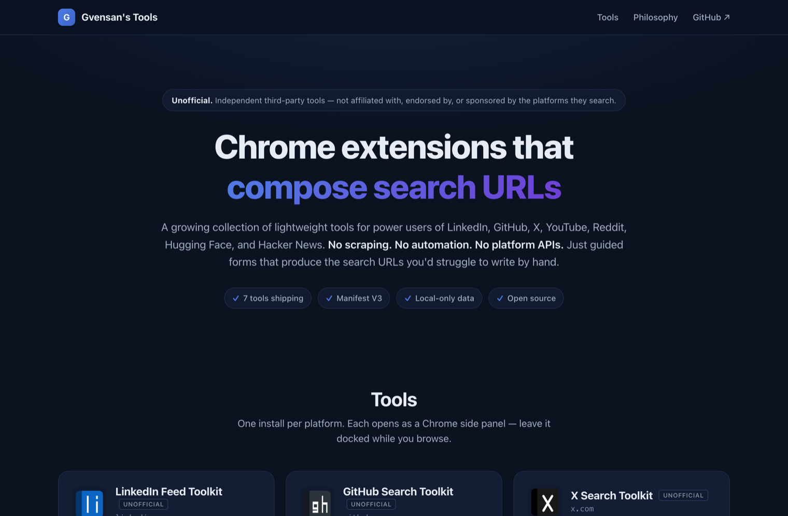

# Search Composer Toolkit

> A family of seven lightweight, **unofficial** Chrome extensions that compose,
> save, and launch high-signal search URLs on platforms whose search syntax is
> opaque to most users — LinkedIn, GitHub, X, YouTube, Reddit, Hugging Face,
> and Hacker News.

<p>
  
  
  
  
  
  
</p>

<p align="center">
  
</p>

Each tool only **composes URLs and opens them in your browser**. No scraping, no
automation, no content scripts on page load, no platform APIs, and no data ever
leaves your machine. The platform does the actual search; the tool just makes
the URL easy to construct.

> [!NOTE]
> **Unofficial.** These are independent, third-party tools — not affiliated with,
> endorsed by, or sponsored by any of the platforms they search. See
> [Disclaimer](#disclaimer).

## Contents

- [Install](#install)
- [What each plugin does](#what-each-plugin-does)
- [Design principles](#design-principles)
- [Build from source](#build-from-source)
- [Development](#development)
- [Project structure](#project-structure)
- [Extending it](#extending-it)
- [Releasing to the Chrome Web Store](#releasing-to-the-chrome-web-store)
- [Permissions and privacy](#permissions-and-privacy)
- [Status and caveats](#status-and-caveats)
- [Disclaimer](#disclaimer)
- [License](#license)

## Install

All seven are published on the Chrome Web Store — **[browse the full publisher
catalog](https://chromewebstore.google.com/search/gvensan)**. Install one, some,
or all — each runs in its own side panel and shares no runtime state with the
others.

| Extension | Platform | Install | Source |
| --- | --- | --- | --- |
| **LinkedIn Feed Toolkit** | linkedin.com | [Chrome Web Store](https://chromewebstore.google.com/detail/linkedin-feed-toolkit-uno/lbhkaflmnjhhigopjkkngfpgnlhaofag) | [`packages/linkedin/`](packages/linkedin/README.md) |
| **GitHub Search Toolkit** | github.com | [Chrome Web Store](https://chromewebstore.google.com/detail/github-search-toolkit-uno/bamjodpfkbojkaapkfdghcbicebmholn) | [`packages/github/`](packages/github/README.md) |
| **X Search Toolkit** | x.com | [Chrome Web Store](https://chromewebstore.google.com/detail/x-search-toolkit-unoffici/jiiogifnplmkgeklpmdlkajkeplpjmfl) | [`packages/x/`](packages/x/README.md) |
| **YouTube Search Toolkit** | youtube.com | [Chrome Web Store](https://chromewebstore.google.com/detail/youtube-search-toolkit-un/lnpjjgpkglodbilhbalaandcegagbgjk) | [`packages/youtube/`](packages/youtube/README.md) |
| **Reddit Search Toolkit** | reddit.com | [Chrome Web Store](https://chromewebstore.google.com/detail/reddit-search-toolkit-uno/hppmkociljhhmpkokbnjlonoblcpjpmf) | [`packages/reddit/`](packages/reddit/README.md) |
| **Hugging Face Search Toolkit** | huggingface.co | [Chrome Web Store](https://chromewebstore.google.com/detail/hugging-face-search-toolk/lbdlopblacolpmebgfkehjjkkacmccmm) | [`packages/huggingface/`](packages/huggingface/README.md) |
| **Hacker News Search Toolkit** | news.ycombinator.com | [Chrome Web Store](https://chromewebstore.google.com/detail/hacker-news-search-toolki/ilpodjbadgihilfmiljejolclokmmlmg) | [`packages/hackernews/`](packages/hackernews/README.md) |

Prefer to run unpacked from source? See [Build from source](#build-from-source).

> You must be signed in to the target platform in the same Chrome profile for
> personalized templates (e.g. "PRs awaiting my review", "Network feed",
> "From a list — latest") to return results.

## What each plugin does

All seven follow the same shape: a **Templates** view (one-click recipes), a
**Builder** view (typed forms per search type), a **Saved** view (your library),
a **Filters** view (saved entities, for plugins that need them), a **Settings**
view (theme, display mode, defaults, JSON backup/restore), and an **About** view
(cross-promotion). They differ in what their search URLs look like:

| Plugin | URL family | Builder shape |
| --- | --- | --- |
| LinkedIn | `linkedin.com/search/results/<type>/?<typed-params>` plus `/jobs/search/?<jobs-params>` | 3 form tabs: Posts, Jobs, People — typed parameters per tab |
| GitHub | `github.com/search?q=<qualifiers>&type=<type>` plus a few "inbox" URLs (`/pulls/review-requested`, `/trending/<lang>`) | 5 form tabs: Repositories, Code, Issues, Pull Requests, Users — qualifier-stacked queries |
| X | `x.com/search?q=<operators>&src=typed_query&f=<filter>` | 1 form with mode tabs (Top / Latest / People / Media) — operator-stacked queries |
| YouTube | `youtube.com/results?search_query=<kw>&sp=<preset>` | 1 form with preset categories (today / this week / HD / long-form / CC license / channels / playlists) — opaque `sp=` filter tokens |
| Reddit | `reddit.com/search/?q=<kw>&type=<type>&sort=<s>&t=<t>` plus subreddit / multireddit listing URLs | 5 form tabs: Posts, Comments, Subreddits, Users, Feed |
| Hugging Face | `huggingface.co/models?<facets>` (plus datasets / spaces) | 3 form tabs: Models, Datasets, Spaces — pipeline-tag + library + license facets |
| Hacker News | `hn.algolia.com/?q=<kw>&type=<t>&dateRange=<r>` | 1 form with story-vs-comment + author + time-range scoping |

LinkedIn additionally ships **saved companies and people** (Filters view):
because LinkedIn's search filters by numeric company ID and opaque profile token
(not by name), users save these entities once with a friendly label and pick
them as chips in the People / Posts builders under "Currently at" / "Previously
at" / "From a company" / "From a person." Other plugins use plain string
identifiers and don't need a saved-entity layer.

For per-plugin usage, templates, and quirks, see each plugin's README linked in
the [Install](#install) table.

## Design principles

Four principles every tool in this collection follows:

- **Compose, don't scrape.** Every tool only generates URLs and opens them via
  `chrome.tabs.create()`. No content scripts, no background polling, no platform
  APIs.
- **Local-first data.** Saved searches, tags, and settings live in
  `chrome.storage.local` on your device. Nothing syncs, nothing is sent
  anywhere. Export writes a JSON file to your disk; you control the rest.
- **Minimum permissions.** Six of seven tools declare only `storage` +
  `sidePanel`. LinkedIn adds `scripting` + a LinkedIn-scoped `host_permissions`
  for its optional, user-triggered ID-capture feature — never on page load. See
  [Permissions and privacy](#permissions-and-privacy).
- **Open source.** The whole monorepo lives here — every URL builder, every
  template, every test.

Technical profile:

- **Manifest V3**, opens as a **side panel** by default (switchable to a classic
  popup in Settings).
- Bundle per extension: ~50 KB gzipped JS + ~5 KB CSS.
- Stack: Vite + Svelte 5 + TypeScript + Tailwind + `@crxjs/vite-plugin`.
- Layout: npm workspaces with a shared `@toolkit/core` package.

## Build from source

```bash
npm install                       # at the monorepo root
npm run build                     # builds all 7 plugins in parallel
```

Then in Chrome → `chrome://extensions` → enable **Developer mode** → click
**Load unpacked** for each plugin you want to install:

- `packages/linkedin/dist/`
- `packages/github/dist/`
- `packages/x/dist/`
- `packages/youtube/dist/`
- `packages/reddit/dist/`
- `packages/huggingface/dist/`
- `packages/hackernews/dist/`

Each operates in its own side panel and shares no runtime state with the others
— the cross-promotion in About → "More from this publisher" is purely
informational (driven by `packages/core/src/family.ts`).

## Development

From the repo root:

```bash
# Build all seven plugins
npm run build

# Build a single plugin
npm run build:linkedin
npm run build:github
npm run build:x
npm run build:youtube
npm run build:reddit
npm run build:huggingface
npm run build:hackernews

# Vite dev server with HMR (single plugin at a time)
npm run dev:linkedin    # default: also `npm run dev`
npm run dev:github
npm run dev:x
npm run dev:youtube
npm run dev:reddit
npm run dev:huggingface
npm run dev:hackernews

# Tests across all packages (Vitest)
npm test                # runs every plugin's suite (~250 tests total)
npm run test:linkedin
npm run test:github
npm run test:x
npm run test:youtube
npm run test:reddit
npm run test:huggingface
npm run test:hackernews

# Type check across all packages
npm run check

# Build + zip release artifacts → release/
npm run release:linkedin
npm run release:all     # all 7 sequentially; --publish flag also uploads to CWS

# Prettier across packages/**/src
npm run format
```

To work inside a specific package directly (rare, prefer the root scripts):

```bash
npm run dev -w @toolkit/github-extension
```

Edit any file under `packages/`; Vite rebuilds; reload the extension in
`chrome://extensions` to pick up changes (or just reopen the side panel for
popup-only changes).

## Project structure

```
package.json                   — npm workspace root (build/dev/test/release scripts per plugin)
tsconfig.base.json             — shared TS compiler options
LICENSE                        — MIT License
.github/workflows/release.yml  — per-plugin tag CI: zip + GitHub release + (optional) CWS upload
.github/workflows/suite-release.yml — root version bump on main (or v* tag): zip all 7 + checksums → one downloadable GitHub release
scripts/
  generate-icons.mjs           — placeholder PNG generator (per-package)
  release.mjs                  — build + zip one package, --publish to upload to CWS
  release-all.mjs              — sequentially release every plugin
documents/
  Requirements.md              — full scope, parameter catalog, risks
  PUBLISHING.md                — Chrome Web Store step-by-step
  STORAGE.md                   — chrome.storage.local architecture
  GROK Summary.md              — original parameter research

packages/
  core/                        — @toolkit/core (shared)
    src/
      storage.ts               — chrome.storage.local with in-memory fallback
      browser.ts               — chrome.tabs.create / current-tab update / copy helpers
      family.ts                — sibling-plugin discovery list
      backup.ts                — buildExport / restoreImport with pluggable per-plugin validator
      stores/
        router.svelte.ts       — generic view router
        saved.svelte.ts        — generic SavedSearchesStore<T> (each plugin instantiates)
      components/              — Tabs, Toggle, ChipGroup, Select, KeywordsField,
                                 BooleanHelper, CollapsibleSection, FamilyCard,
                                 FamilySection, SaveSearchDialog, SavedSearchRow,
                                 EditingBanner, Spinner
      index.ts                 — public API surface

  linkedin/                    — @toolkit/linkedin-extension (host_permissions for LinkedIn)
  github/                      — @toolkit/github-extension
  x/                           — @toolkit/x-extension
  youtube/                     — @toolkit/youtube-extension
  reddit/                      — @toolkit/reddit-extension
  huggingface/                 — @toolkit/huggingface-extension
  hackernews/                  — @toolkit/hackernews-extension
```

Each plugin package follows the same internal layout:

```
src/
  manifest.json                — MV3 manifest (minimum: storage + sidePanel)
  background/service-worker.ts — popup-vs-sidepanel toggle for the action click
  lib/
    url-builder/               — typed URL builders per search type
    params.ts                  — option lists for select/chip controls
    templates.ts               — built-in template list (BUILTIN_TEMPLATES)
    template-preview.ts        — one-line human summary per template card
  popup/
    App.svelte                 — root + view router
    components/                — *Form per search type + shared list components
    stores/                    — builder / saved (4-line shim) / settings
    views/                     — Templates / Builder / Saved / (Filters) / Settings / About
tests/                         — vitest (url-builder + parsers)
public/icons/                  — toolbar + store icons
```

Shared infrastructure — Save dialog, Saved row, generic store class, storage
helpers, view router, all the small Svelte primitives — lives in `packages/core`
and is imported via `@toolkit/core`. Adding a new plugin involves writing its own
`lib/url-builder/`, `lib/templates.ts`, and `*Form.svelte` files; everything else
is reused.

## Extending it

### Add a new built-in template

1. Open `packages/<plugin>/src/lib/templates.ts`.
2. Append an entry to `BUILTIN_TEMPLATES` with a unique `id`, title,
   description, and `search` matching the existing shapes for that plugin.
3. Run `npm run test:<plugin>` — the suite verifies every template produces a
   valid platform URL and that all IDs are unique.

### Add a new parameter to an existing search type

1. Add the field to the input interface in
   `packages/<plugin>/src/lib/url-builder/types.ts`.
2. Emit it in the corresponding builder file.
3. Add a test case in `packages/<plugin>/tests/url-builder.test.ts`.
4. (Optional) Surface it in the form: add the option list to
   `packages/<plugin>/src/lib/params.ts` and a control in the relevant
   `*Form.svelte`.

### Add a new platform extension

The six sibling packages (github / x / youtube / reddit / huggingface /
hackernews) were scaffolded from `packages/linkedin/` and serve as up-to-date
references:

1. Copy `packages/linkedin/` to `packages/<platform>/`.
2. Rename the package in its `package.json` to `@toolkit/<platform>-extension`.
3. Replace `src/lib/url-builder/`, `src/lib/params.ts`, `src/lib/templates.ts`
   with platform-specific equivalents.
4. Tune the `*Form.svelte` files for the new fields, and adjust
   `BuilderView.svelte` if the platform needs a different number of form tabs
   (or a single form with mode tabs, like X / hackernews).
5. Update `src/manifest.json` (name, description, icons).
6. Update `currentId` in `SettingsView.svelte`'s `<FamilySection>` (or About
   view) and add the entry to `packages/core/src/family.ts`.
7. Add `dev:<platform>`, `build:<platform>`, `test:<platform>`,
   `release:<platform>` scripts to the root `package.json`.
8. Append `<platform>-v*` to the tag-trigger list in
   `.github/workflows/release.yml`.
9. `npm install` to wire the new workspace package.

Most of `@toolkit/core` is reusable as-is — `SaveSearchDialog`, `SavedSearchRow`,
`SavedSearchesStore<T>`, all the small primitives (Tabs, Toggle, ChipGroup,
Select, KeywordsField, BooleanHelper, Spinner, EditingBanner), storage layer,
browser helpers, and the view router carry over.

### Replace placeholder icons

```bash
node scripts/generate-icons.mjs <plugin>      # any of the 7 plugin names
```

Or drop real PNGs at `packages/<plugin>/public/icons/icon-{16,32,48,128}.png`.

## Releasing to the Chrome Web Store

See **[`documents/PUBLISHING.md`](documents/PUBLISHING.md)** for the full
step-by-step. Short version:

```bash
npm run release:linkedin                 # build + zip → release/
npm run release:all                      # all 7 sequentially
node scripts/release.mjs linkedin --publish  # upload to CWS (needs env vars)
```

Or tag-triggered CI: bump `manifest.json` + `package.json` versions, commit, then
`git tag linkedin-v0.2.0 && git push --tags`. The
`.github/workflows/release.yml` workflow builds, zips, attaches the zip to a
GitHub Release, and (if the `EXTENSION_ID_<PLUGIN>` secret is configured)
auto-uploads to the Chrome Web Store.

When a plugin is published, set `webStoreUrl` on its entry in
`packages/core/src/family.ts` so siblings cross-promote it with an active "Open"
button (already set for all seven).

### Downloadable suite release

`.github/workflows/suite-release.yml` publishes all seven extensions together as
a single downloadable GitHub Release — all 7 zips plus a `SHA256SUMS.txt`. It
runs the test suite, builds and zips every plugin, writes checksums, and attaches
everything to one Release. It **never** uploads to the Chrome Web Store; it only
produces downloadable artifacts.

It fires three ways:

- **Automatic on version bump.** A push to `main` that **increases the root
  `package.json` `version`** auto-cuts a `v<version>` release. A push that leaves
  the version unchanged does nothing — so the release condition is simply
  *"did the suite version go up?"* The normal flow is to bump the version in the
  same PR as the changes you're shipping; merging it triggers the release.
- **Suite tag.** `git tag v0.2.0 && git push origin v0.2.0`.
- **Manual.** Run the workflow from the Actions tab and type a tag.

```bash
# Cut a release by bumping the suite version, then merging to main:
npm version 0.2.0 --no-git-tag-version   # edits root package.json "version"
# commit + merge to main → suite-release.yml builds and publishes v0.2.0

npm run release:all                      # or locally: build + zip all 7 → release/ + SHA256SUMS.txt
```

The release tag is the **suite version** (root `package.json`). The suite zips
use **stable, versionless names** (`linkedin.zip`, `github.zip`, …) so a direct
download link never rots across versions — e.g. the landing page's per-card
"Download" buttons and
`…/releases/latest/download/<plugin>.zip` always resolve to the newest release.
Each zip's bundled `manifest.json` still carries its own per-plugin version.
(The per-plugin Web Store path in `release.yml` keeps versioned
`<plugin>-v<version>.zip` names; only the suite bundle uses stable names.) Suite
tags (`v*`) are distinct from the per-plugin tags (`<plugin>-v*`), so the two
workflows never collide. Users verify a download with
`sha256sum -c SHA256SUMS.txt`.

## Permissions and privacy

Each extension declares the minimum necessary set:

- `storage` — persist saved searches, settings, and (LinkedIn only) saved
  companies/people locally.
- `sidePanel` — drive the side-panel display mode.

The LinkedIn plugin additionally declares two LinkedIn-specific capabilities to
power its **"From current tab"** company-and-person capture feature:

- `host_permissions: ["*://*.linkedin.com/*"]` — scoped to LinkedIn only. Grants
  the extension permission to read tab URLs and run user-triggered scripts on
  `linkedin.com` tabs. **No non-LinkedIn tab data is ever visible** to the
  extension. (We tried `activeTab` first; it was unreliable in side-panel mode
  because every navigation inside the LinkedIn tab ended the temporary grant.)
- `scripting` — paired with the host permission to inject a single-purpose
  regex-match function (`/urn:li:fsd_company:(\d+)/` or
  `/(?:urn:li:fsd_profile:|/in/)(ACoA[A-Za-z0-9_-]{20,})/`) into the rendered
  HTML of `linkedin.com/company/<slug>/` or `linkedin.com/in/<vanity>/` pages on
  user click. The function runs once per click, returns only the matched
  ID/token, and reads nothing else.

The other six plugins (GitHub, X, YouTube, Reddit, Hugging Face, Hacker News)
declare **no** tab/host/scripting permissions. They only call
`chrome.tabs.create()` to open generated URLs, which requires no permission at
all.

None of the plugins hit platform APIs, run content scripts on page load, send
data to remote servers, or read cookies. All data lives in `chrome.storage.local`
(this device only) and never leaves your machine. Backup/restore is JSON
file-based; the export is written to your disk via the browser's download
mechanism, never uploaded.

Use of platform search URLs is subject to each platform's terms. These tools are
intended for manual, human-driven use; do not pair them with scraping or
automation.

## Status and caveats

### LinkedIn
- All four search verticals functional: Posts, Jobs, People (no Newsletter —
  LinkedIn doesn't expose a stable URL form for it).
- Posts builder supports `postedBy` chips (1st-degree / People I follow /
  **Me**), `fromOrganization` (company), `fromMember` (person — uses the opaque
  `ACoAA…` profile token, not the legacy numeric URN), `mentionsOrganization`,
  `mentionsMember`, and a Content type filter (`videos` / `photos` /
  `documents`).
- Jobs builder: `f_TPR` recency, `f_F` job functions, `f_VJ` "Has
  verifications," `f_AL` "Under 10 applicants," `f_JIYN` "In your network,"
  `f_C` companies, `f_WT` workplace, `f_E` experience level, `f_JT` job type,
  `f_EA` Easy Apply.
- People builder: Industry typeahead, current/past companies via saved-entity
  chips, network degree, title free text.
- The "Me" chip is gated on capturing your own profile token in Settings → Your
  LinkedIn profile (one-click via `linkedin.com/me/` redirect or paste of your
  vanity).
- All facet-tagged searches emit `origin=FACETED_SEARCH` /
  `origin=JOB_SEARCH_PAGE_JOB_FILTER` — matches LinkedIn's UI behavior; without
  it certain filter combinations get dropped.
- Some parameters are documented only by empirical observation and marked
  **Beta** in the UI; LinkedIn may rename them without notice.
- LinkedIn's content search has no past-hour date filter — smallest posts window
  is past-24h.
- Mobile LinkedIn ignores most of these parameters — desktop only.

### GitHub
- Templates and builders functional across Repositories / Code / Issues / Pull
  Requests / Users.
- All qualifier emission unit-tested. `qualifier()` auto-quotes whitespace
  values (e.g. `location:"San Francisco"`).
- Boolean qualifiers like `archived` and `draft` only emit when the field is
  explicitly `true` or `false` (undefined skips them).

### X
- Single form with mode tabs (Top / Latest / People / Media). Operator emission
  unit-tested, including hashtag/mention prefix normalization (a leading `#` or
  `@` is stripped if the user includes it).
- Zero-valued engagement floors (`min_faves:0` etc.) are omitted from the query.
- Boolean helper shared from `@toolkit/core`; operators (AND / OR / NOT / quotes)
  apply identically across all seven plugins.

### YouTube, Reddit, Hugging Face, Hacker News
- See each plugin's README for plugin-specific details and any beta caveats. All
  four use the same Templates/Builder/Saved/Settings shape as the others;
  differences are in the URL families and parameter sets.

See [`documents/Requirements.md`](documents/Requirements.md) for full scope,
future-extension hooks, and the original parameter catalog.

## Disclaimer

These are **independent, unofficial** tools. They are **not affiliated with,
endorsed by, or sponsored by** LinkedIn, GitHub, X, YouTube, Reddit, Hugging
Face, Hacker News, or any of their parent companies.

LinkedIn, GitHub, X, YouTube, Reddit, Hugging Face, Hacker News, and their logos
are trademarks of their respective owners. They are used here only to identify
the platform each tool helps you search (nominative use) and do not imply any
association or endorsement.

These tools compose search URLs from each platform's current public search
syntax, which can change at any time and may break a tool without notice. Use of
platform search URLs is subject to each platform's terms of service; the tools
are intended for manual, human-driven use and must not be paired with scraping
or automation. Everything here is provided **"as is," without warranty of any
kind** — see [License](#license).

## License

Released under the **MIT License** — see [`LICENSE`](LICENSE).
